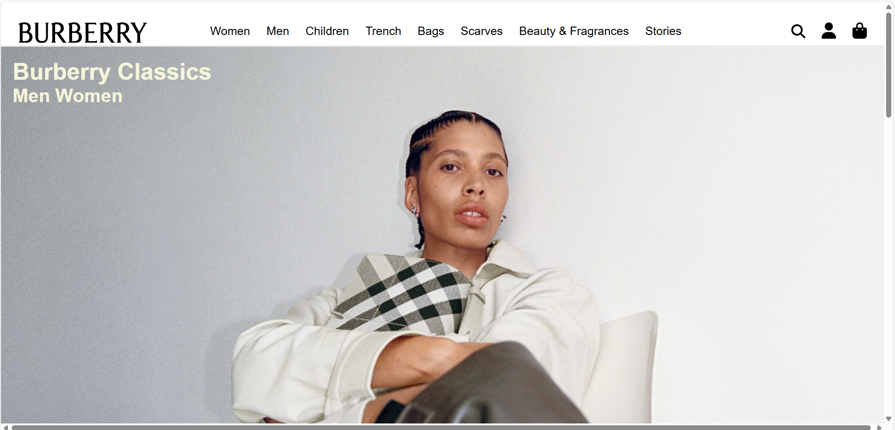
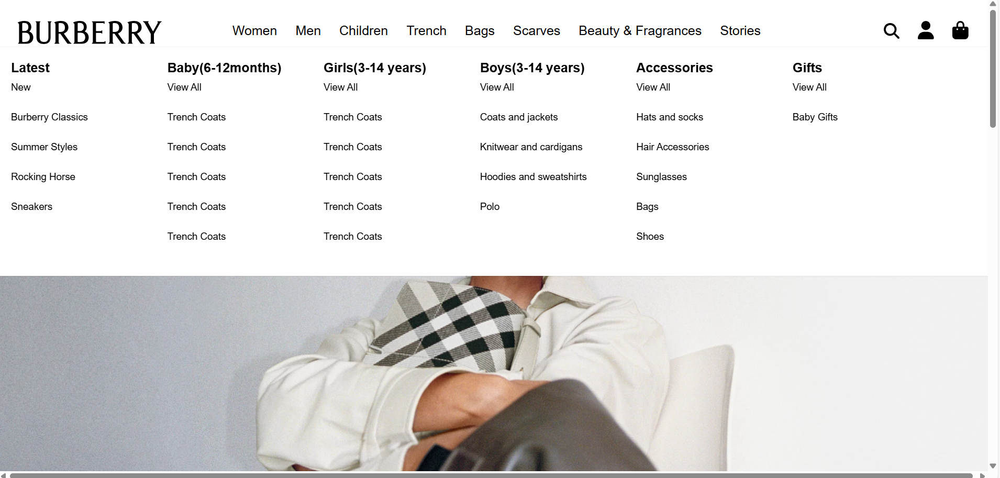
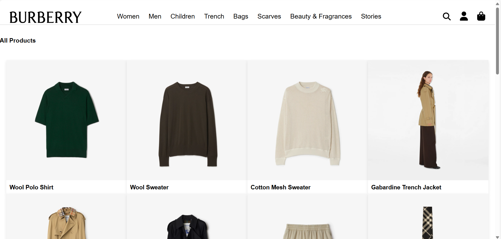
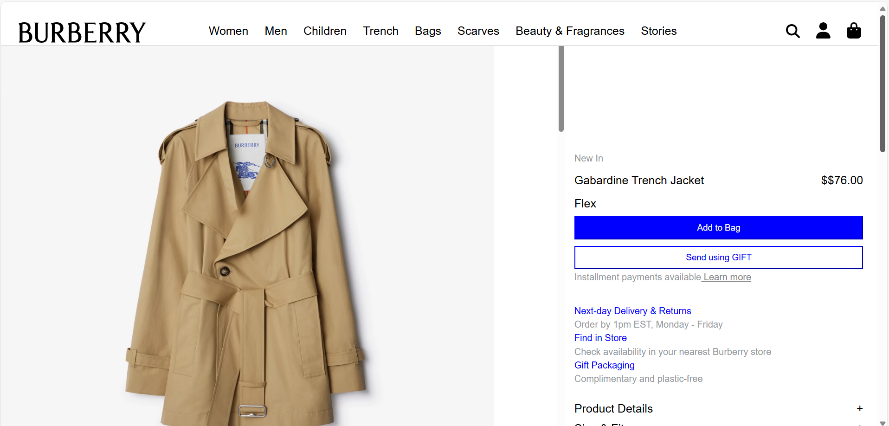
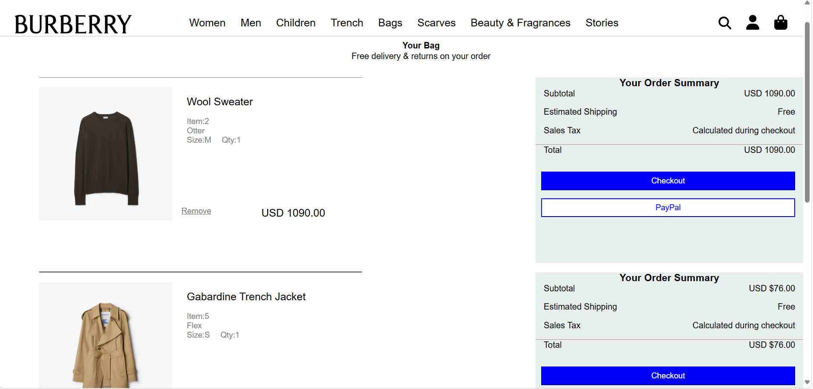
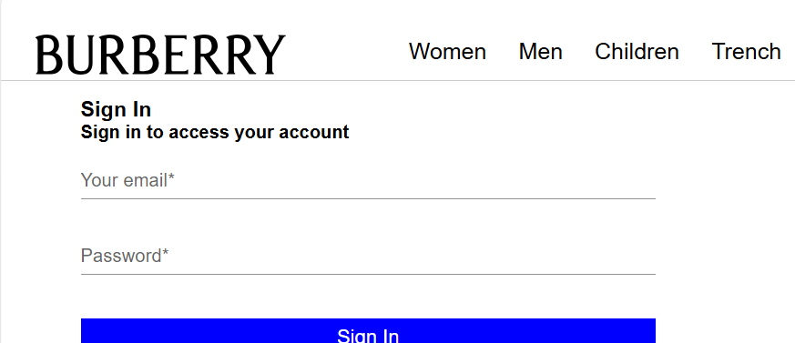

# Burberry-Clone
A fully functional clone of Burberry.com built using React.js, replicating key features and UI design to enhance frontend development skills.

Features

Component-Based Architecture: Ensures modular, reusable, and maintainable code.

State Management: Efficiently handles data flow and user interactions.

Responsive Design: Optimized for various screen sizes and devices.

Interactive UI: Provides a seamless and engaging user experience.

Technologies Used

React.js: Frontend library for building interactive user interfaces.

React Router: Enables smooth navigation between pages.

Styled Components / CSS Modules: Manages styling efficiently.

Json:for backend purposes

Installation & Setup

Clone the repository:

git clone https://github.com/NityashreeM/Burberry-Clone.git

Install dependencies(to run the react project):

npm install

Start the development server:

npm run dev

Open your browser and visit http://localhost:3000

Install dependencies(to run the json file):

npm install -g json-server

Start the json server on http://localhost:5000/:

json-server --watch db.json --port 5000

Folder Structure

Burberry-Clone/
|── node modules
│── public/
│── src/
|   ├── assets/
│   ├── components/  
│   ├── pages/       
│── db.json        
│── package-lock.json       
│── package.json
│── README.md

Images:
home page of our website:

navbar of our website:

product page of our website:

single product page of our website:

cart page of our website:

signIn gpage of our website:

